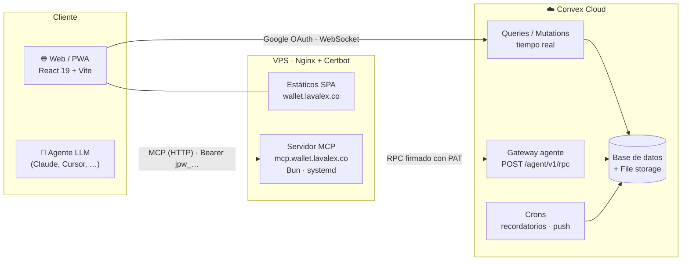

<div align="center">


# JP-Wallet

**Finanzas personales con tiempo real, hecha para Colombia y lista para agentes de IA.**

Registra movimientos, controla presupuestos y gastos fijos, gestiona créditos y metas de ahorro, organiza tu declaración de renta… y conéctale **cualquier LLM compatible con MCP** para preguntarle a tus finanzas en lenguaje natural.

[](https://wallet.lavalex.co)
[](https://mcp.wallet.lavalex.co/healthz)


</div>

---

## ✨ Qué hace

| | Módulo | Lo que obtienes |
|---|---|---|
| 🏠 | **Dashboard** | Balance total, ingresos vs. gastos del período, movimientos recientes y proyección *“si pagas los fijos”*. |
| 💸 | **Transacciones** | Ingresos, gastos y transferencias con filtros, búsqueda y **adjuntos** (recibos, facturas, PDFs). |
| 🏦 | **Cuentas** | Efectivo, banco y tarjetas con balance en tiempo real y transferencias entre cuentas. |
| 🏷️ | **Categorías** | Personalizables con icono y color; semilla inicial al crear la cuenta. |
| 📊 | **Presupuestos y gastos fijos** | Límites por categoría con alertas 80 % / 100 % y *Pagos del mes* con recordatorios, mora (+3/+6 días) y “omitir este mes”. |
| 📈 | **Reportes** | Desglose por categoría y tendencias (Recharts) con exportación a PDF. |
| 💳 | **Créditos** | Préstamos flexibles (libre inversión, vivienda…), abonos extraordinarios a capital con recálculo de plazo y destinos del desembolso. |
| 🎯 | **Ahorro y metas** | Metas con progreso visual, aportes y cuenta vinculada. |
| 🧾 | **Declaración de renta (DIAN)** | Organizador anual: patrimonio, deudas, ingresos, deducciones y rentas exentas, con sugerencias desde tus datos y exportación para tu contador. |
| 🔔 | **Notificaciones** | Web Push fuera de la app, toasts dentro de ella y deep links a la pantalla correcta. |
| 🤖 | **Acceso para agentes (MCP)** | Tokens personales con *scopes* para que Claude, Cursor u otros agentes lean y operen tus finanzas. |
| 🎨 | **Personalización** | Tema oscuro (por defecto), claro o sistema; presets de acento y tipografía; agrupación semanal, mensual, trimestral o semestral. |

---

## 🧱 Arquitectura



- **El servidor MCP no tiene lógica de negocio**: traduce tools/resources/prompts de MCP a llamadas al gateway de Convex. El dominio vive en un solo lugar, compartido por la web y los agentes.
- **Tokens personales (PAT)** `jpw_…` guardados como hash (con *pepper* opcional), con *scopes* por recurso (`read:transactions`, `write:budgets`, …) y *rate limit*.
- **Calendario America/Bogotá (UTC-5)** para meses, vencimientos y reportes.

---

## 🤖 Conecta tu agente (MCP)

1. En la app ve a **Ajustes → Acceso para agentes / MCP** y crea un token con los *scopes* que necesites.
2. Agrega el servidor a tu cliente MCP:

```json
{
  "mcpServers": {
    "jp-wallet": {
      "url": "https://mcp.wallet.lavalex.co/mcp",
      "headers": { "Authorization": "Bearer jpw_xxx" }
    }
  }
}
```

<details>
<summary><b>🛠️ Tools disponibles (19)</b></summary>

**Lectura**

| Tool | Para qué |
|---|---|
| `get_financial_overview` | Balances, ingresos/gastos del período y movimientos recientes |
| `list_transactions` | Transacciones con filtros de fecha, cuenta y categoría |
| `get_spending_summary` | Totales y desglose por categoría en un rango |
| `list_accounts` · `list_categories` | Cuentas y categorías del usuario |
| `list_budgets` | Límites por categoría del mes con gastado/restante |
| `list_fixed_expenses` | Gastos fijos (“Pagos del mes”) y `pendingTotal`; usa `period: "YYYY-MM"` e `includePaid` |
| `list_credits` · `list_savings_goals` | Créditos y metas de ahorro |
| `list_tax_documents` · `get_tax_document` | Declaración de renta por año |

**Escritura**

| Tool | Para qué |
|---|---|
| `create_transaction` · `update_transaction` · `delete_transaction` | CRUD de movimientos |
| `upsert_budget` | Crear/editar límites del mes |
| `create_savings_goal` · `contribute_to_goal` | Metas de ahorro |
| `create_tax_item` · `update_tax_item` | Ítems de la declaración |

</details>

> 💡 **Tip para agentes:** pide los meses como `period: "2026-10"` en lugar de timestamps. Así evitas errores de año y zona horaria; la respuesta incluye `periodKeys` y `currentPeriodKey` para verificar.

Más detalles (modo `--stdio`, variables, despliegue): [`apps/mcp-server/README.md`](apps/mcp-server/README.md) · contrato: [`changes/mcp-access/contracts/mcp-tools.md`](changes/mcp-access/contracts/mcp-tools.md).

---

## 🚀 Empezar en local

**Requisitos:** [Bun](https://bun.sh) ≥ 1.3, una cuenta de [Convex](https://convex.dev) y un Client ID de Google OAuth.

```bash
# 1. Dependencias
bun install

# 2. Variables de entorno
cp .env.example .env          # completa VITE_CONVEX_URL, VITE_GOOGLE_CLIENT_ID, …

# 3. Backend Convex (en otra terminal)
bunx convex dev
bunx convex env set SITE_URL http://localhost:5173
bunx convex env set AUTH_GOOGLE_ID "<client-id>"
bunx convex env set AUTH_GOOGLE_SECRET "<secret>"
bun run convex:setup-jwt

# 4. App web → http://localhost:5173
bun dev
```

### Scripts

| Comando | Qué hace |
|---|---|
| `bun dev` | App web en modo desarrollo (Vite) |
| `bun build` | Typecheck + build de producción |
| `bun lint` / `bun lint:fix` | Biome (lint + formato) |
| `bun test convex/lib` | Tests unitarios del dominio (bun:test) |
| `bun run test:e2e` | Tests E2E con Playwright |
| `bun run mcp:dev` | Servidor MCP en HTTP (`:3100`) |
| `bun run mcp:stdio` | Servidor MCP por stdio |

---

## 🗂️ Estructura

```
JP-Wallet/
├── apps/
│   ├── web/              # SPA React 19 + Vite + PWA (rutas, features, stores Zustand)
│   └── mcp-server/       # Servidor MCP (HTTP + stdio) → gateway Convex
├── packages/
│   └── jp-ds/            # Design system JP-DS: tokens CSS, componentes, motion
├── convex/               # Backend: schema, queries/mutations, gateway de agentes, crons
│   └── lib/              # Lógica de dominio pura + tests unitarios
├── changes/              # Specs SDD por change (proposal · spec · design · tasks)
├── docs/                 # Auditorías y documentación transversal
├── scripts/              # Deploy VPS, bootstrap MCP, setup JWT
├── desing.md             # Design system visual (tokens, temas, motion, a11y)
└── SPEC.md               # Especificación del producto y roadmap
```

---

## 🎨 JP-DS · *Green Bolt*

Design system propio en [`packages/jp-ds`](packages/jp-ds) con la guía en [`desing.md`](desing.md):

- **Acento** `#07FBA2` sobre un tema **oscuro por defecto**, más claro y sistema.
- Tokens en CSS custom properties (`var(--color-*)`); nada de hex sueltos en componentes.
- **Mobile-first** desde 375 px hasta desktop, con glassmorphism sutil y *motion tokens* que respetan `prefers-reduced-motion`.

---

## 🧭 Cómo se construye (SDD)

Cada funcionalidad es un **change** con propuesta, spec (escenarios GIVEN/WHEN/THEN), diseño técnico y tareas en [`changes/`](changes).

| # | Change | Estado |
|---|---|---|
| 1 | `web-foundation` — base, auth Google, JP-DS | ✅ |
| 2 | `web-core` — cuentas, transacciones, categorías, dashboard | ✅ |
| 3 | `web-settings` — perfil, apariencia, preferencias | ✅ |
| 4 | `web-budgets-reports` — presupuestos, gastos fijos, reportes | ✅ |
| 5 | `web-credits` — créditos, abonos y metas de ahorro | ✅ |
| 6 | `web-tax-dian` — organizador de declaración de renta | ✅ |
| 7 | `mcp-access` — tokens de agente + servidor MCP | ✅ |
| 8 | `app-polish-fixes` — pulido UX + E2E | ✅ |
| 9 | `notifications-polish` — push, deep links, mora | 🚧 |
| 10 | `security-hardening` — adjuntos, PAT, rate limit, CSP | 🚧 |

**Flujo de ramas:** `feat/*` → `testing` → `main`. Cada push a `main` despliega automáticamente Convex, la web y el servidor MCP ([`deploy-production.yml`](.github/workflows/deploy-production.yml)).

---

## 🔐 Seguridad

- Login con **Google OAuth** (`@convex-dev/auth`) y todo el acceso a datos limitado al usuario autenticado.
- PAT guardados **solo como hash**, con *scopes* mínimos, revocables y con *rate limit* en el gateway.
- Validación de metadatos y procedencia de adjuntos, allowlist de deep links y cabeceras HSTS/CSP en Nginx.
- Auditoría: [`docs/security-audit-2026-09.md`](docs/security-audit-2026-09.md).

---

<div align="center">

Hecho con 💚 por [**@josephprada**](https://github.com/josephprada) · Colombia 🇨🇴

</div>
